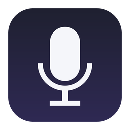
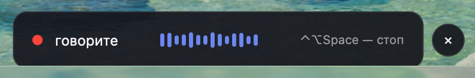
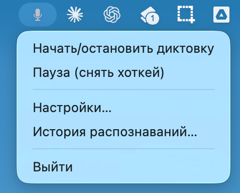
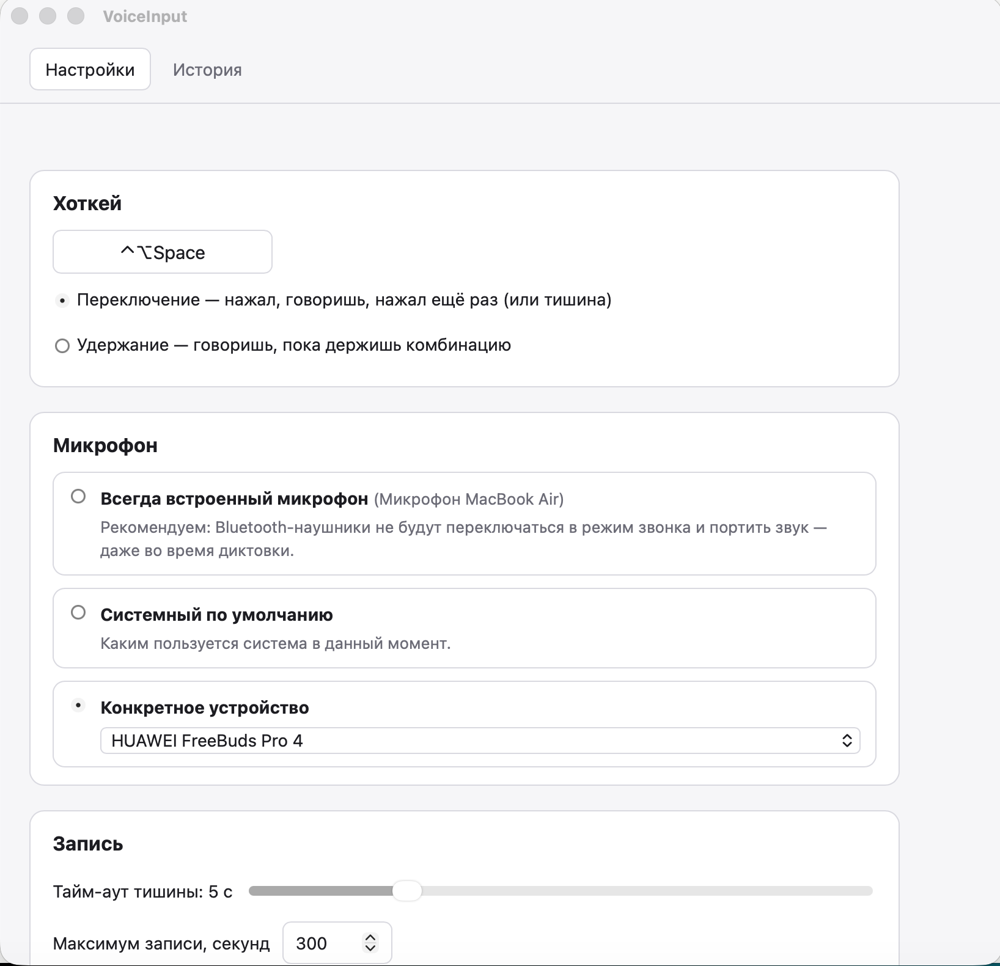
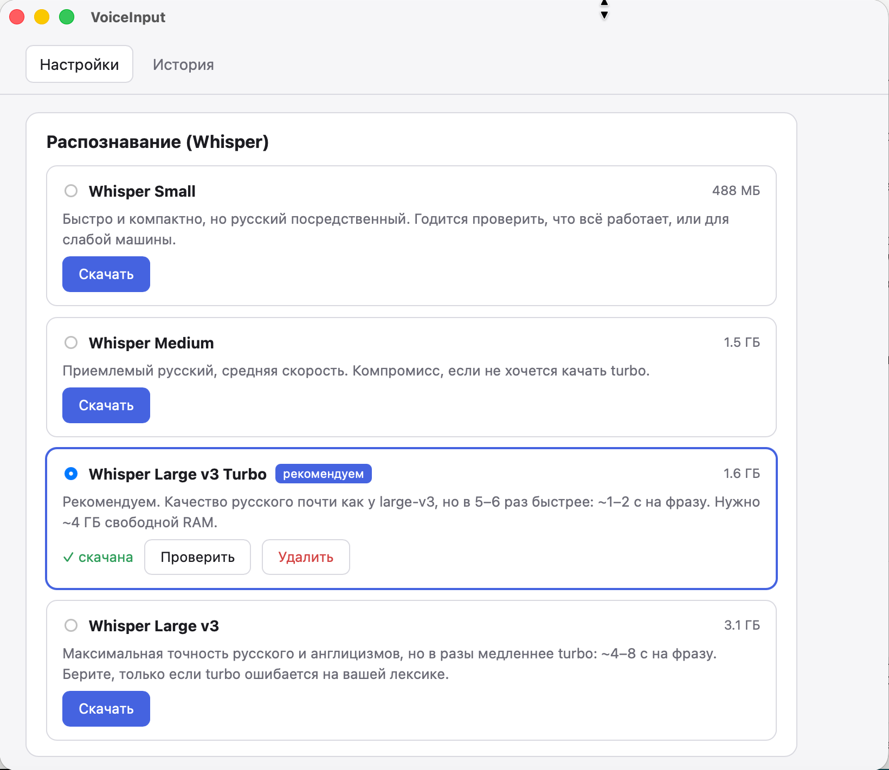
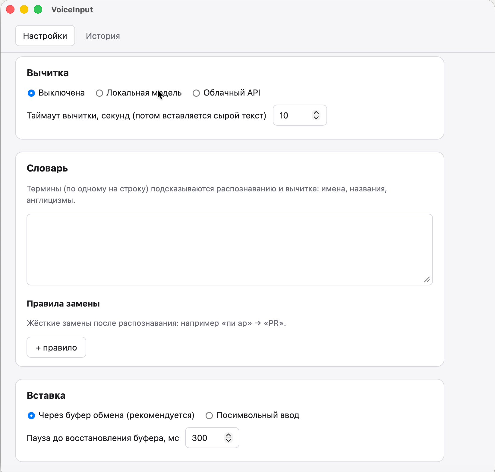

<div align="center">



# VoiceInput

**Голосовой ввод для macOS и Windows: нажал хоткей — сказал — текст появился в любом приложении.**

Локальное распознавание (Whisper), умная вычитка, полная приватность.
Русская речь с англицизмами — «задеплой на стейджинг и создай пул-реквест» распознаётся как надо.

[%20%7C%20Windows%2010%2F11%20x64-black)](#требования)
[](https://github.com/tarakan1991/voice-input/releases/latest)
[](LICENSE)



</div>

---

## Возможности

- 🎙️ **Диктовка в любое приложение** — Telegram, браузер, редактор кода, заметки. Текст вставляется туда, где стоял курсор.
- 🔒 **Полностью офлайн** — распознавание и вычитка работают локально, аудио и текст не покидают ваш компьютер. Облачная вычитка — только если сами включите.
- 🎧 **Дружит с Bluetooth-наушниками** — микрофон открывается только на время диктовки, а по умолчанию используется встроенный микрофон компьютера (или любой выбранный, например вебкамера). Наушники не переключаются в «телефонный» режим и не портят звук музыки — ради этого всё и затевалось.
- 🇷🇺 **Русский с англицизмами** — «пул-реквест», «задеплоить», «фича» распознаются корректно; словарь замен доводит термины до нужного вида («пи ар» → «PR»).
- ✍️ **Вычитка** — убирает «ээ», «ну короче», оговорки и самоповторы, расставляет запятые. Локальной моделью (Qwen) или облаком (Anthropic / OpenAI / DeepSeek) — на выбор. Смысл не переписывает.
- ⌨️ **Два режима хоткея** — «переключение» (нажал — говоришь — нажал) или «удержание» (говоришь, пока держишь).
- 🤫 **Автостоп по тишине** — замолчали на 5 секунд (настраивается) — запись остановится сама, с обратным отсчётом на плашке.
- 🕓 **История распознаваний** — всё продиктованное можно найти и скопировать. Отключается.
- 📋 **Бережная вставка** — содержимое буфера обмена сохраняется и восстанавливается.

## Скриншоты

| Диктовка | Меню в строке меню |
|---|---|
|  |  |

| Настройки | Модели распознавания |
|---|---|
|  |  |

| Вычитка, словарь и вставка |
|---|
|  |

## Как установить (5 минут)

### macOS

Понадобится Мак на Apple Silicon (M1 и новее) и ~4 ГБ свободного места.

1. **Скачайте установщик**: зайдите на [страницу релизов](https://github.com/tarakan1991/voice-input/releases/latest) и возьмите файл `VoiceInput_..._aarch64.dmg`.
2. **Откройте dmg** и перетащите **VoiceInput** в папку **Программы**.
3. **Первый запуск.** Приложение не подписано сертификатом Apple (нет платного аккаунта разработчика), поэтому macOS сначала откажется его открывать. Это ожидаемо, лечится одним разом:
   - Запустите VoiceInput из Программ → появится предупреждение → нажмите «Готово»/«ОК».
   - Откройте **Системные настройки → Конфиденциальность и безопасность**, прокрутите вниз — там будет строка про VoiceInput и кнопка **«Всё равно открыть»**. Нажмите её и подтвердите.
   - На macOS 12–14 проще: правый клик по приложению → «Открыть» → «Открыть».
4. **Мастер настройки** проведёт по шагам:
   - выдача прав (Микрофон и Универсальный доступ — мастер сам открывает нужный раздел настроек и видит, когда право выдано);
   - выбор и скачивание модели распознавания — берите рекомендованную **Whisper Large v3 Turbo** (1.6 ГБ, скачивается один раз);
   - вычитка — можно пропустить и включить позже;
   - микрофон — оставьте «всегда встроенный», если пользуетесь Bluetooth-наушниками;
   - хоткей и финальная проверка: скажите фразу и увидите результат.
5. **Готово.** Приложение живёт в строке меню (иконка микрофона). Поставьте курсор в любое поле, нажмите `⌃⌥Space`, говорите, нажмите ещё раз (или просто замолчите) — текст вставится сам.

> 💡 Если после диктовки текст не вставился — он лежит в буфере обмена, просто нажмите `⌘V`. Так бывает, если во время обработки переключиться в другое приложение.

### Windows

Понадобится компьютер с Windows 10 или 11 (64-бит) и ~4 ГБ свободного места.

1. **Скачайте установщик**: зайдите на [страницу релизов](https://github.com/tarakan1991/voice-input/releases/latest) и возьмите файл `VoiceInput_..._x64-setup.exe`.
2. **Запустите установщик.** Windows покажет синее окно **«Система Windows защитила ваш компьютер»** (SmartScreen) — это ожидаемо: установщик не подписан платным сертификатом. Нажмите **«Подробнее»**, затем **«Выполнить в любом случае»**.
3. Пройдите установку. В конце установщик спросит, **запускать ли VoiceInput автоматически при входе в Windows** — рекомендуем согласиться, приложение живёт в фоне и не мешает.
4. **Мастер настройки** проведёт по шагам:
   - доступ к микрофону — если он выключен в системе, мастер откроет нужный раздел Параметров;
   - выбор и скачивание модели распознавания — берите рекомендованную **Whisper Large v3 Turbo** (1.6 ГБ, скачивается один раз);
   - вычитка — можно пропустить и включить позже;
   - микрофон и хоткей, затем финальная проверка: скажите фразу и увидите результат.
5. **Готово.** Приложение живёт в области уведомлений (иконка микрофона возле часов). Поставьте курсор в любое поле, нажмите `Ctrl+Alt+Space`, говорите, нажмите ещё раз (или просто замолчите) — текст вставится сам.

> 💡 Если после диктовки текст не вставился — он лежит в буфере обмена, просто нажмите `Ctrl+V`. Так бывает, если во время обработки переключиться в другое приложение.

## Требования

**macOS**
- Мак на **Apple Silicon** (M1/M2/M3/M4…). Intel не поддерживается.
- macOS 12 или новее.

**Windows**
- Windows 10 или 11, только 64-бит (x64); процессор с AVX2 (Intel 2013+ / AMD Ryzen).
- Видеокарта или встроенная графика с драйвером Vulkan — подойдёт любая NVIDIA, AMD или Intel не старше ~2016 года (драйвер ставится вместе с обычным видеодрайвером). Распознавание и вычитка идут на GPU: фраза обрабатывается за секунды.

**Общее**
- ~2 ГБ на диске для модели распознавания (+1–5 ГБ, если включите локальную вычитку).
- 8 ГБ оперативной памяти (16 ГБ — комфортно для вычитки моделью 7B).

## Приватность

Аудио записывается **только между нажатиями хоткея** — вне диктовки микрофон полностью закрыт, системный индикатор погашен. Распознавание (whisper.cpp) и вычитка (llama.cpp) работают на вашем компьютере. В интернет приложение ходит только за скачиванием моделей и — если вы явно включили облачную вычитку — отправляет провайдеру уже распознанный **текст** (никогда аудио). История хранится локально и отключается в настройках.

## Для разработчиков

Стек: Tauri v2 + Rust, TypeScript + Svelte 5, whisper.cpp, llama.cpp, Silero VAD.

```bash
git clone https://github.com/tarakan1991/voice-input.git
cd voice-input
npm install
cargo tauri dev          # разработка
CI=true cargo tauri build  # macOS: сборка .app + .dmg
npx tauri build            # Windows: сборка NSIS-инсталлера
```

На Windows дополнительно нужны: VS Build Tools (C++), CMake, LLVM
(`LIBCLANG_PATH` → каталог с `libclang.dll`) и Vulkan SDK (`VULKAN_SDK`) —
их требуют сборки whisper.cpp/llama.cpp, bindgen и GPU-бэкенд ggml.
Если сборка падает с MSB3491 (путь длиннее 260 символов) — включите
длинные пути NTFS (`LongPathsEnabled`), детали в CLAUDE.md.

Документация: [SPEC.md](SPEC.md) — спецификация и архитектура (платформенные трейты — Windows-порт задуман с первого дня), [CLAUDE.md](CLAUDE.md) — рабочие правила и команды, [PROGRESS.md](PROGRESS.md) — статус и чеклист приёмки.

## Планы

- [x] Windows 10/11 (с GPU-ускорением через Vulkan: NVIDIA / AMD / Intel)
- [ ] Push-to-talk на одиночный модификатор (правый ⌘ / Fn)
- [ ] Автообновление

## Лицензия

[MIT](LICENSE)
