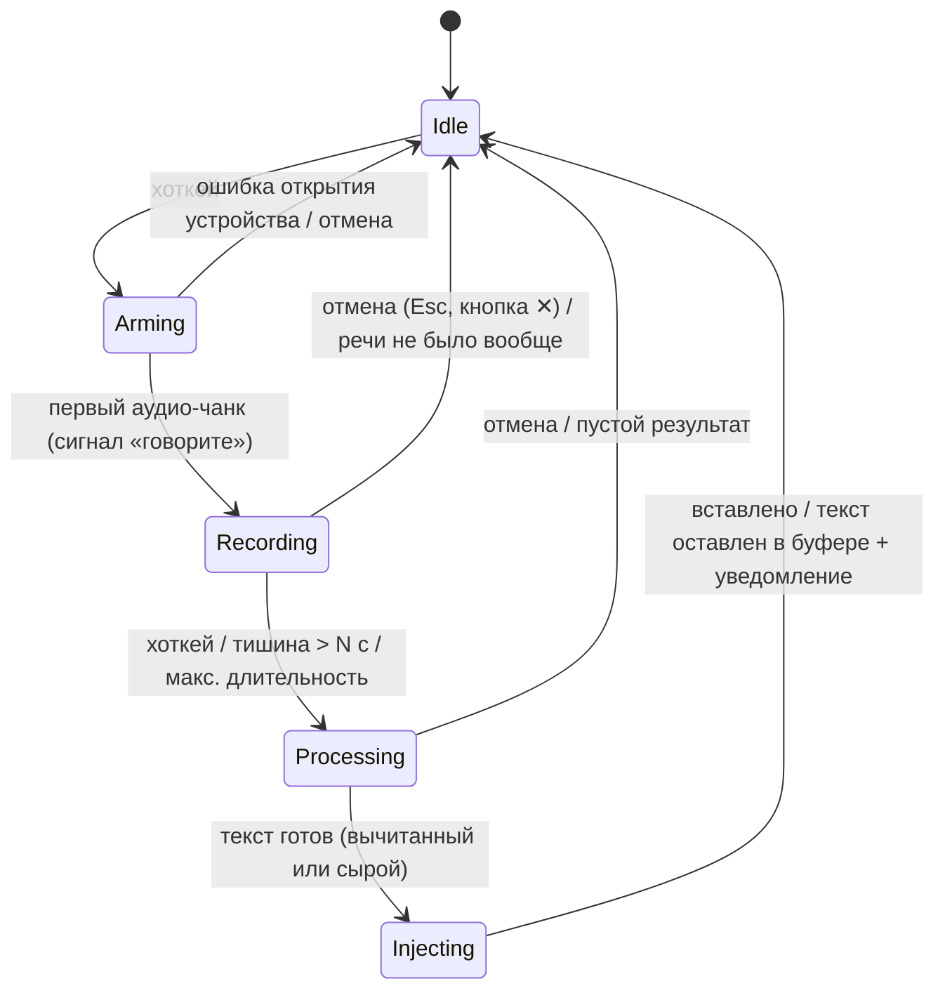

# VoiceInput — спецификация продукта

Рабочее название: **VoiceInput**, идентификатор `com.vixarev.voiceinput`.
Имя не принципиально и меняется одной правкой в `tauri.conf.json`.

## 1. Что это

Десктопное приложение для голосового ввода текста (аналог Wispr Flow) для macOS и
Windows. Пользователь работает в любом приложении, жмёт глобальный хоткей, диктует
по-русски (свободно вставляя англицизмы), текст распознаётся локально, вычитывается
и вставляется в поле, где стоял курсор.

Сценарий целиком:

1. Приложение висит в фоне, иконка в трее показывает статус
   (простой / запись / обработка / ошибка).
2. Пользователь работает в любом приложении, курсор стоит в поле ввода.
3. Нажатие глобального хоткея → внизу экрана появляется узкая плашка-оверлей.
4. Плашка показывает «подключаю микрофон…», и как только аудиопоток реально пошёл —
   звуковой сигнал + статус «говорите» с живым индикатором уровня.
5. Пользователь диктует. Запись останавливается повторным хоткеем либо тишиной
   дольше N секунд (дефолт 5, настраивается).
6. Текст распознаётся (whisper.cpp), прогоняется через словарь замен и вычитку
   (локальная LLM или облачный API), вставляется в исходное поле через буфер
   обмена. Буфер пользователя восстанавливается.

## 2. Ключевые требования приёмки

Это инварианты. Любое изменение, которое их ломает, — регрессия, даже если всё
остальное стало лучше.

1. **Микрофон открыт только во время записи.** Аудиопоток на вход создаётся в
   момент старта записи и полностью закрывается сразу после остановки (или отмены,
   или ошибки — по любому пути выхода). Вне записи — ни одного открытого
   input-стрима, системный индикатор микрофона погашен. Никакого «слушаем всегда»,
   keep-alive потоков, hot-word детекторов.
2. **Оверлей не забирает фокус.** Поле ввода в целевом приложении остаётся
   в фокусе всё время диктовки.
3. **Буфер обмена восстанавливается.** Содержимое буфера до вставки (текст, RTF,
   картинка) возвращается после вставки.
4. **Диктовка не теряется молча.** Упала постобработка — вставляем сырой текст.
   Не удалась вставка — текст остаётся в буфере обмена и в истории, показывается
   уведомление.
5. **Отбивка честная.** Сигнал «говорите» — только когда поток реально отдаёт
   сэмплы, чтобы первые слова не срезались.
6. **Латентность.** Полный цикл «стоп записи → текст вставлен» для фразы 10–15 с:
   цель ≤ 4 с на Apple Silicon (large-v3-turbo + Qwen2.5-3B).

## 3. Зафиксированные решения (по итогам обсуждения)

| Вопрос | Решение |
|---|---|
| Режим активации | Только toggle (нажал — говоришь — нажал/тишина). Push-to-talk и клавиша Fn — не в v1; Input Monitoring не требуется |
| Хоткей по умолчанию | `⌃⌥Space` (Ctrl+Option+Space), настраивается в мастере |
| Микрофон по умолчанию | «Всегда встроенный микрофон» — дефолт. BT-гарнитура никогда не переключается в HFP; любое другое устройство выбирается явно |
| Смена фокуса во время диктовки | Фокус в том же приложении — вставляем. Фокус ушёл в другое приложение — НЕ вставляем: текст в буфер обмена + история + уведомление |
| Платформа macOS | Только Apple Silicon (aarch64), macOS 12+. Intel не поддерживаем |
| Распространение | Личное пользование. Без подписи/нотаризации Apple (раздел 12) |
| ASR-модель по умолчанию | large-v3-turbo (рекомендация мастера) |
| Языки | Только русский с англицизмами. `language=ru` зашит, шаг выбора языка из мастера исключён |
| История | SQLite, сырой + вычитанный текст, лимит 500, отключаемо, без шифрования |
| Локальная вычитка | llama.cpp через биндинги (не Ollama) — обоснование в разделе 7 |
| VAD | Silero (ONNX) — обоснование в разделе 6 |

## 4. Архитектура

### 4.1 Принцип платформенной изоляции

Разработка в два этапа: сначала macOS целиком, потом Windows. Чтобы второй этап не
стал переписыванием, с первого дня действует правило:

> Весь код, который трогает ОС, живёт за трейтами в `platform/`, с реализациями в
> `platform/macos/` и `platform/windows/`. Общий код о существовании платформ не
> знает и платформенных типов не видит.

Механика:

- Трейты и общие типы (`AudioDevice`, `Permission`, `FocusSnapshot`, …) объявлены в
  `platform/mod.rs`. Там же — единственная в кодовой базе фабрика с
  `#[cfg(target_os)]`, отдающая набор реализаций (`PlatformServices`).
- Общий код получает `Arc<dyn Trait>` и не содержит ни одного
  `#[cfg(target_os)]` (это проверяется на ревью, см. CLAUDE.md).
- На этапе macOS все реализации в `platform/windows/` — заглушки с
  `unimplemented!()`. Структура видна сразу, проект компилируется под macOS.

### 4.2 Трейты: состав и разбор

Эскизы API — ориентир, не догма; сигнатуры уточняются в коде.

#### AudioCapture

```rust
pub trait AudioCapture: Send + Sync {
    fn list_devices(&self) -> Result<Vec<AudioDevice>>;
    /// Встроенный микрофон машины, если есть (для опции «всегда встроенный»).
    fn builtin_device(&self) -> Result<Option<AudioDevice>>;
    /// Открывает поток. Колбэк получает чанки сэмплов (нативный формат устройства).
    fn open(&self, device: &DeviceSelector, on_chunk: ChunkCallback)
        -> Result<Box<dyn CaptureStream>>;
}

pub trait CaptureStream: Send {
    /// Синхронно останавливает поток и полностью освобождает устройство.
    /// Drop делает то же самое — страховка от утечки по паникам/ранним выходам.
    fn close(self: Box<Self>);
}
```

Реализация: базой служит **cpal** (кроссплатформенный аудио-крейт: CoreAudio на
macOS, WASAPI на Windows) — он закрывает ~90 % трейта для обеих платформ.
Платформенным остаётся определение «встроенного» устройства: на macOS —
CoreAudio `kAudioDevicePropertyTransportType == BuiltIn`, на Windows — перебор
эндпоинтов WASAPI по форм-фактору. Трейт сохраняем в полном объёме: если cpal
подведёт по ключевому инварианту (полное освобождение устройства, погасший
индикатор), реализация заменяется на нативную без изменений в общем коде.

#### GlobalHotkey

```rust
pub trait GlobalHotkey: Send + Sync {
    /// Err(AlreadyTaken), если комбинацию не удалось занять.
    fn register(&self, combo: &HotkeyCombo, cb: HotkeyCallback) -> Result<HotkeyId>;
    fn unregister(&self, id: HotkeyId) -> Result<()>;
}
```

Реализация: `tauri-plugin-global-shortcut` (обе платформы). Регистрируются: основной
хоткей (постоянно) и `Esc` (только на время записи — как отмена). Проверка «занято»
— по ошибке регистрации; ограничение: ОС сообщает о конфликте только с другими
глобальными хоткеями, конфликт с внутренними шорткатами приложений не детектится
(риск R-10).

#### TextInjector

Оркестрация вставки (сохранить буфер → положить текст → вставить → восстановить)
— общий код. Платформенные — только две примитивные операции:

```rust
pub trait TextInjector: Send + Sync {
    /// Эмулирует Cmd+V (macOS) / Ctrl+V (Windows).
    fn send_paste_shortcut(&self) -> Result<()>;
    /// Посимвольный ввод юникод-строки (запасной режим).
    fn type_text(&self, text: &str) -> Result<()>;
}
```

macOS: `CGEventPost` (требует право Accessibility); посимвольный ввод —
`CGEventKeyboardSetUnicodeString`. Windows: `SendInput` (+ `KEYEVENTF_UNICODE`).
Буфер обмена — крейт `arboard` в общем коде (текст + картинки).

#### FocusTracker

```rust
pub trait FocusTracker: Send + Sync {
    /// Снимок перед стартом записи: приложение (pid, bundle id / exe), имя окна.
    fn snapshot(&self) -> Result<FocusSnapshot>;
    /// То же ли приложение сейчас в фокусе (для решения «вставлять или нет»).
    fn is_same_app_focused(&self, snap: &FocusSnapshot) -> Result<bool>;
}
```

macOS: `NSWorkspace.frontmostApplication`. Windows: `GetForegroundWindow` +
`GetWindowThreadProcessId`. Восстановление фокуса *конкретного поля* в чужом
приложении в трейт сознательно не входит — это нереализуемо надёжно (см. решение в
разделе 3: при смене приложения не вставляем).

#### PermissionChecker

```rust
pub enum Permission { Microphone, Accessibility, InputMonitoring }
pub enum PermissionStatus { Granted, Denied, NotDetermined, NotApplicable }

pub trait PermissionChecker: Send + Sync {
    /// Права, реально нужные на этой платформе в текущей конфигурации.
    fn required(&self) -> Vec<Permission>;
    fn status(&self, p: Permission) -> PermissionStatus;
    /// Системный запрос, где он существует (микрофон на macOS).
    fn request(&self, p: Permission) -> Result<()>;
    /// Открыть соответствующий раздел системных настроек.
    fn open_settings(&self, p: Permission) -> Result<()>;
}
```

macOS v1: **Microphone** (`AVCaptureDevice`) и **Accessibility**
(`AXIsProcessTrustedWithOptions`). Input Monitoring в v1 не нужен (toggle-хоткей и
CGEventPost его не требуют) — вариант зарезервирован в enum под будущий
push-to-talk/Fn. Разделы настроек открываются URL-схемой
`x-apple.systempreferences:com.apple.preference.security?Privacy_*`.
Windows: прав почти нет — проверка системного тумблера доступа к микрофону,
`open_settings` ведёт на `ms-settings:privacy-microphone`; остальное —
`NotApplicable`.

#### OverlayWindow

```rust
pub trait OverlayWindow: Send + Sync {
    /// Делает окно Tauri неактивирующимся (не забирает фокус) поверх всех окон.
    fn make_non_activating(&self, win: &tauri::WebviewWindow) -> Result<()>;
    fn set_click_through(&self, win: &tauri::WebviewWindow, on: bool) -> Result<()>;
}
```

macOS: превращение NSWindow в **NSPanel** со стилем `nonactivatingPanel`
(+ уровень `statusBar`, `collectionBehavior` для всех Spaces и полноэкранных
приложений). Кандидат — community-плагин `tauri-nspanel`; фолбэк — прямые вызовы
через `objc2` (~150 строк). Windows: стили `WS_EX_NOACTIVATE | WS_EX_TOPMOST |
WS_EX_TOOLWINDOW` через raw handle. Самый платформенно-рискованный трейт (риск R-1).

#### Autostart

```rust
pub trait Autostart: Send + Sync {
    fn is_enabled(&self) -> Result<bool>;
    fn set_enabled(&self, on: bool) -> Result<()>;
}
```

Реализация — обёртка над `tauri-plugin-autostart` (обе платформы штатно).

### 4.3 Честная оценка: что общее, что платформенное

Три трейта (AudioCapture, GlobalHotkey, Autostart) — фактически обёртки над
кроссплатформенными библиотеками: их «платформенные реализации» тонкие, и трейты тут
служат страховкой на случай замены библиотеки, а не границей больших объёмов кода.
Содержательно платформенные: OverlayWindow, FocusTracker, PermissionChecker,
TextInjector — все компактные (десятки–сотни строк каждый).

Оценка долей (по объёму кода):

| Слой | Доля | Состав |
|---|---|---|
| Общий Rust | ~65 % | машина состояний сессии, VAD, ASR, постобработка, словарь, загрузчик моделей, конфиг, история, оркестрация вставки, аудио-конвейер |
| Фронтенд (TS) | ~20 % | оверлей, мастер, настройки, история — общий на 100 % |
| Платформенный | ~15 % | реализации трейтов + инсталлеры + CI-матрица |

Трудозатраты этапа Windows при соблюдении границ: **~15–20 % от общего объёма**
(реализации трейтов — дни, а не недели; основной риск — отладка
`WS_EX_NOACTIVATE` с WebView2 и нюансы SendInput в конкретных приложениях).

Неразделимых абстракций не вижу. Единственная честная оговорка: поведение
*внутри* одинаковых трейтов различается тонко (тайминги вставки, порядок событий
фокуса), поэтому приёмочный чеклист (раздел 14) прогоняется на каждой платформе
отдельно — трейты изолируют код, но не избавляют от платформенного тестирования.

### 4.4 Машина состояний сессии диктовки



- **Arming** — устройство открывается; плашка показывает «подключаю микрофон…».
  Всё записанное с первого чанка попадает в буфер (ничего не теряем).
- **Recording** — VAD ведёт таймер тишины; отсчёт до автостопа виден на плашке.
  Если речь так и не началась — по тому же таймауту отмена без вставки.
- **Processing** — ASR → словарь замен → вычитка → словарь замен. Повторный хоткей
  в этом состоянии игнорируется (плашка мигает «обрабатываю»).
- Любой выход из Arming/Recording — в том числе паника, ошибка, отмена —
  гарантированно закрывает поток: стрим владеется сессией и закрывается по RAII
  (`Drop`), а не «не забыть вызвать close».

### 4.5 Жизненный цикл микрофона — конструктивные гарантии

Требование №1 обеспечивается конструкцией, а не дисциплиной:

1. `CaptureStream` существует только как поле объекта состояния
   `Arming`/`Recording`. Переход в любое другое состояние уничтожает объект →
   `Drop` закрывает поток. Утечка стрима становится ошибкой типов, а не забытым
   вызовом.
2. Ватчдог максимальной длительности (дефолт 5 мин, настраивается) — защита от
   залипшего VAD.
3. В коде нет ни одного пути, создающего стрим вне перехода `Idle → Arming`.
4. Ручная приёмка (macOS): после каждой диктовки оранжевая точка микрофона в
   строке меню гаснет; `система > звук` не показывает активного входа; повторить
   20 циклов старт/стоп подряд, включая отмены и ошибки.

## 5. Аудио-конвейер (общий код)

- Устройство открывается на нативной частоте/формате; конвертация в **16 кГц
  моно f32** (ресемплер `rubato`) — общий код, вход для VAD и Whisper.
- Уровень для индикатора — RMS по чанкам, шлётся в оверлей событиями (~30 Гц).
- Звуковые отбивки: старт («говорите»), стоп, отмена, ошибка. Проигрываются через
  устройство вывода (микрофон не трогают, HFP не провоцируют). Файлы вшиты в
  бинарь, отключаются в настройках.

## 6. Определение тишины (VAD)

**Выбор: Silero VAD** (ONNX-модель ~2 МБ, крейт `voice_activity_detector` поверх
`ort`/onnxruntime).

- Почему не webrtc-vad: он энергетически-спектральный и заметно хуже отличает
  тихую речь от шума кондиционера/вентилятора — ровно тот сценарий, который
  пользователь назвал недопустимым. Silero — нейросетевой, устойчив к стационарному
  шуму.
- Цена: зависимость от onnxruntime (+~20–40 МБ к приложению). Принимаем; если
  окажется болезненной — за интерфейсом `VadEngine` webrtc-vad остаётся запасной
  реализацией.
- Механика: окна 32 мс @ 16 кГц → вероятность речи; гистерезис (порог входа выше
  порога выхода) против дребезга. Таймер тишины стартует после последнего
  речевого окна; дефолт 5 с, настройка 2–15 с.
- Обрезка: ведущая/хвостовая тишина не отдаётся в Whisper (меньше галлюцинаций,
  быстрее распознавание).

## 7. Распознавание и постобработка

### 7.1 ASR: whisper.cpp

- Крейт `whisper-rs`, сборка с Metal (Apple Silicon).
- Параметры: `language = "ru"` жёстко (не auto), `translate = false`,
  `temperature = 0`, `initial_prompt` из словаря (раздел 8).
- Фильтр галлюцинаций: известные артефакты русских моделей Whisper на
  тишине/шуме («Субтитры сделал …», «Продолжение следует…», «Редактор субтитров …»)
  — чёрный список + подавление сегментов с высоким `no_speech_prob`.

Модели в мастере (описания — человеческим языком, прямо такими и показываем):

| Модель | Файл | Описание в мастере |
|---|---|---|
| small | ~490 МБ | «Быстро и компактно, но русский посредственный. Годится проверить, что всё работает, или для слабой машины» |
| medium | ~1.5 ГБ | «Приемлемый русский, средняя скорость. Компромисс, если не хочется качать turbo» |
| **large-v3-turbo** | ~1.6 ГБ | «**Рекомендуем.** Качество русского почти как у large-v3, но в 5–6 раз быстрее: ~1–2 с на фразу. Нужно ~4 ГБ свободной RAM» |
| large-v3 | ~3.1 ГБ | «Максимальная точность русского и англицизмов, но в разы медленнее turbo: ~4–8 с на фразу. Берите, только если turbo ошибается на вашей лексике» |

Скорость «на этой машине» в мастере — не из таблицы, а замер: после скачивания
модель прогоняется на вшитом сэмпле, и пользователю показывается фактическое время
(см. раздел 9).

### 7.2 Постобработка: задача

Вход — сырой текст Whisper, выход — текст «как набран руками»:

- убраны филлеры («ээ», «мм», «ну это самое», «как бы», «короче» — если это не
  смысловое слово);
- убраны самоповторы и оговорки («я хотел… я хотел сказать» → «я хотел сказать»);
- расставлена пунктуация (в первую очередь запятые);
- исправлены грамматика и согласование;
- заглавные буквы, где надо;
- **смысл и формулировки не переписываются**: вычитка, а не пересказ. Ничего не
  добавлять, не сокращать, не «улучшать стиль».

### 7.3 Движок: llama.cpp, не Ollama

**Решение: llama.cpp через крейт `llama-cpp-2`** (биндинги c Metal).

| | llama.cpp встроенно | Ollama |
|---|---|---|
| Установка | ничего доустанавливать не надо | отдельная установка + фоновый сервис |
| Контроль жизненного цикла | модель грузим/выгружаем сами | чужой демон со своей политикой памяти |
| Интеграция | линкуется в бинарь | HTTP API (проще, но это единственный плюс) |

Требование «нормальный установщик, ничего не доустанавливать руками» несовместимо с
Ollama, а тащить и молча ставить её инсталлятор внутри своего — хрупко и
непрозрачно. llama.cpp дороже в первичной интеграции (сборка, биндинги), но это
разовая цена.

Модели вычитки в мастере (личное пользование — лицензия Qwen2.5-3B не мешает):

| Модель | Файл | Описание в мастере |
|---|---|---|
| Qwen2.5-1.5B-Instruct Q4_K_M | ~1.0 ГБ | «Самая быстрая, базовая вычитка. Если хочется мгновенно» |
| **Qwen2.5-3B-Instruct Q4_K_M** | ~2.0 ГБ | «**Рекомендуем.** Хороший русский, ~1–2 с на фразу» |
| Qwen2.5-7B-Instruct Q4_K_M | ~4.7 ГБ | «Лучшее качество, ощутимо медленнее. Для Mac с 16+ ГБ RAM» |

Память: модели (Whisper + LLM) грузятся лениво при первой диктовке и остаются в
памяти для тёплого старта; по простою (дефолт 15 мин, настраивается) выгружаются —
чтобы приложение в фоне не держало ~4–5 ГБ RAM постоянно.

### 7.4 Промпт вычитки (черновик, будет калиброваться)

```
Ты — корректор надиктованного текста. Перед тобой сырая расшифровка речи.
Приведи её к виду, как будто автор набрал текст руками:
— убери филлеры («ээ», «мм», «ну это самое», «как бы», «короче» и т.п.);
— убери оговорки и самоповторы, оставив финальный вариант фразы;
— расставь знаки препинания и заглавные буквы;
— исправь грамматику и согласование.
Запрещено: перефразировать, менять смысл, добавлять или выбрасывать содержание,
«улучшать стиль». Сохраняй термины и англицизмы автора как есть: {{словарь}}.
Верни только исправленный текст, без комментариев.
```

Плюс 2–3 few-shot примера (диктовка → результат) в контексте — на маленьких
моделях это даёт больше, чем любая формулировка инструкции.

### 7.5 Защита от отсебятины и падений

- `temperature = 0`.
- Проверка длины: результат вне диапазона 0.5–1.4 от длины входа (в словах) →
  считаем, что модель пересказала/съела текст → вставляем сырой.
- Пустой/мусорный результат → сырой текст.
- Таймаут вычитки 10 с → сырой текст.
- Вычитка недоступна (модель не скачана, API не отвечает, ключ невалиден) →
  сырой текст + ненавязчивое уведомление (не молча).

### 7.6 Облачный режим (опция)

- Провайдеры: Anthropic / OpenAI / DeepSeek; ключ вводится в настройках, хранится
  в системном хранилище (Keychain / Credential Manager, крейт `keyring`) — не в
  конфиг-файле.
- В облако уходит только распознанный **текст** (аудио — никогда). Это осознанный
  опт-ин, по умолчанию выключено.
- Те же guardrails и таймаут, что у локального режима.

## 8. Русский с англицизмами

Кейс нетривиальный, решается на трёх уровнях:

1. **Уровень ASR — `initial_prompt`.** Whisper учитывает подсказку (~224 токена
   бюджета). Формируем её как естественный текст из: (а) терминов пользовательского
   словаря (приоритет), (б) встроенного базового списка IT-англицизмов:
   *задеплоить, стейджинг, продакшен, пул-реквест, мердж, коммит, ребейз, фича,
   баг, фикс, хотфикс, релиз, пайплайн, бэкенд, фронтенд, девопс, докер,
   кубернетес, эндпоинт, миддлвэр, токен, апрув, ревью, таска, спринт, легаси,
   рефакторинг, роллбэк, конфиг, билд* (список пополняется). Это смещает декодер к
   «задеплоить» вместо «за деплоить» / «to deploy».
2. **Уровень словаря — правила замены.** Применяются к тексту детерминированно,
   дважды: после ASR (до вычитки) и после вычитки (LLM может «починить» термин
   обратно). Формат правила: `от` → `к`, литерал или regex, флаг регистра.
   Примеры: «пи ар» → «PR», «гит хаб» → «GitHub».
3. **Уровень вычитки.** Термины словаря подставляются в промпт LLM с инструкцией
   сохранять написание.

Пользовательский словарь редактируется в настройках, две секции:

```json
{
  "terms": ["стейджинг", "Kubernetes", "Tauri", "фамилии, имена, названия…"],
  "replacements": [
    { "from": "пи ар", "to": "PR", "regex": false, "ignore_case": true }
  ]
}
```

`terms` работают через initial_prompt и промпт LLM (мягкое смещение),
`replacements` — жёсткие правила постфактум. Хранится в конфиге, экспортируется
вместе с ним.

## 9. Модели: скачивание и проверка

- Модели **не вшиваются** в установщик. Манифест вшит в приложение:
  `{ id, файл, url (Hugging Face), sha256, размер, RAM, описание }`.
  Хэши фиксируются в манифесте при добавлении модели (скачали — посчитали —
  закоммитили), обновление манифеста = обновление приложения.
- Загрузчик: прогресс, докачка после обрыва (HTTP Range), пауза/отмена.
- После скачивания: проверка SHA256 → при несовпадении файл удаляется, понятная
  ошибка и предложение перекачать.
- **Тестовый прогон**: ASR-модель прогоняется на вшитом WAV-сэмпле (3–5 с русской
  речи с англицизмом), LLM — на вшитом примере вычитки. Пользователю показывается
  результат и замеренное время («на вашей машине: 1.3 с») — это же число
  используется в описаниях моделей.
- Каталог: `~/Library/Application Support/VoiceInput/models/` (macOS),
  `%APPDATA%\VoiceInput\models\` (Windows).
- Смена модели в настройках — тот же загрузчик, старую модель можно удалить.

## 10. UI

### 10.1 Оверлей-плашка

- Узкая плашка (~360×48) внизу экрана по центру, поверх всех окон, на экране,
  где находится окно с фокусом. Видна на всех Spaces и над полноэкранными окнами.
- **Не забирает фокус** (инвариант №2): non-activating NSPanel / WS_EX_NOACTIVATE
  через трейт OverlayWindow.
- Содержимое: статус («подключаю микрофон…» / «говорите» / «обрабатываю»), живой
  индикатор уровня, обратный отсчёт тишины (появляется после ~2 с молчания:
  «стоп через 3…»), подсказка хоткея, кнопка отмены ✕.
- Click-through: реализация — **два окна**: сама плашка полностью click-through
  (`set_click_through(true)`), кнопка ✕ — отдельное крошечное неактивирующееся
  окно, принимающее клики. Это надёжнее, чем динамическое переключение
  ignore-cursor-events по позиции курсора (запасной вариант, если два окна
  окажутся неудобными).

### 10.2 Мастер первого запуска

Пошагово, с невозможностью «проскочить» сломанный шаг:

1. **Разрешения** (только реально нужные: на macOS — Microphone, Accessibility).
   Для каждого: фактический статус → кнопка «открыть настройки» (прямо в нужный
   раздел) → автоматическая перепроверка статуса (поллинг, галочка загорается
   сама). Не «выдайте права», а проверка + помощь + перепроверка.
2. **ASR-модель**: выбор из таблицы раздела 7.1, скачивание, SHA256, тестовый
   прогон с показом результата и замером скорости.
3. **Вычитка**: локальная модель (та же процедура) / облачный API (ввод ключа +
   проверочный запрос) / «пока без вычитки».
4. **Микрофон**: список устройств; дефолт — «всегда встроенный микрофон»
   (объяснение: «ваша Bluetooth-гарнитура не будет переключаться в режим звонка и
   портить звук»).
5. **Хоткей**: назначение с живой проверкой «комбинация занята».
6. **Таймаут тишины**: дефолт 5 с, слайдер 2–15 с.
7. **Автозапуск** при логине: да/нет.
8. **Финальный тест**: «нажмите хоткей и скажите фразу» — показываются сырой текст
   и результат вычитки рядом. Пользователь видит, что всё работает, до закрытия
   мастера.

### 10.3 Настройки

Хоткей; микрофон (+«всегда встроенный»); таймаут тишины; макс. длительность записи;
ASR-модель (со сменой/докачкой); режим вычитки (локально/облако/выкл, модель, ключ);
словарь (термины + правила замены); история (вкл/выкл, лимит, очистить); звуковые
отбивки вкл/выкл; режим вставки (буфер обмена / посимвольный ввод); выгрузка моделей
по простою; автозапуск. Закрытие окна настроек прячет его в трей, приложение
продолжает работать.

### 10.4 Трей

- Иконка-статус: простой / запись / обработка / ошибка / пауза.
- Меню: старт/стоп записи, пауза (хоткей временно снят, приложение не реагирует),
  настройки, история, выход.

### 10.5 История

Локальный SQLite (`rusqlite`): дата, сырой текст, вычитанный текст, приложение-
получатель, длительность, модель, статус (вставлено / оставлено в буфере /
отменено). Лимит 500 записей (настраивается), кнопки «копировать» и «очистить всё»,
выключатель «не вести историю». Без шифрования, файл в профиле пользователя.

## 11. Вставка текста

Оркестрация (общий код):

1. Снимок фокуса сделан ещё при старте записи (до показа оверлея).
2. Перед вставкой — проверка `is_same_app_focused`: приложение сменилось → не
   вставляем, текст в буфер обмена + история + уведомление (решение из раздела 3).
3. Основной путь: сохранить буфер (текст/RTF/картинка через arboard) → положить
   свой текст → `send_paste_shortcut()` → пауза ~300 мс (приложению нужно время
   обработать Cmd+V) → восстановить буфер.
4. Запасной путь — посимвольный ввод (`type_text`): для приложений, игнорирующих
   программный Cmd+V или обрабатывающих буфер нестандартно (некоторые терминалы,
   Java-приложения, окна RDP/VNC). В v1 переключается глобальной настройкой;
   per-app правила — кандидат на v1.x.
5. Известные ограничения (фиксируем честно): менеджеры буфера обмена увидят наш
   транзитный текст (косметика, не лечится); поля с secure input (пароли) на macOS
   блокируют синтетические события — детектируем `IsSecureEventInputEnabled` и
   показываем понятную ошибку вместо молчаливого сбоя.

## 12. Установка и дистрибуция

- **macOS**: `.dmg`, только Apple Silicon (aarch64). Личное пользование, поэтому
  без Apple Developer ID: сборка на своей машине → quarantine-атрибута нет, всё
  открывается сразу; dmg, скачанный из GitHub Releases, потребует один раз
  правый клик → «Открыть» (или `xattr -dr com.apple.quarantine`). Ad-hoc подпись
  включена (Tauri по умолчанию). Если когда-нибудь понадобится публичная раздача:
  Apple Developer Program ($99/год) → сертификат Developer ID Application →
  нотаризация `notarytool` — у Tauri это штатно настраивается через переменные
  окружения CI, архитектурных изменений не потребует.
- **Windows** (этап 2): NSIS-инсталлер, галочка автозапуска при установке.
  Без code-signing сертификата будет SmartScreen-предупреждение — для личного
  пользования приемлемо.
- **CI (GitHub Actions)**: на каждый push — сборка (macos-14/aarch64), `cargo test`,
  `clippy -D warnings`, `fmt --check`. На тег `v*` — release workflow с артефактом
  .dmg (этап 2 добавит windows-latest + NSIS).
- **Автообновление — задел, не функциональность v1**: релизы публикуются в формате,
  совместимом с `tauri-plugin-updater` (versioned artifacts в GitHub Releases);
  сам плагин в v1 не подключаем.

## 13. Конфигурация

JSON (`serde`) в `~/Library/Application Support/VoiceInput/config.json` /
`%APPDATA%\VoiceInput\`. Поле `config_version` для миграций. Секреты (API-ключи) —
только в Keychain/Credential Manager, в файле их нет. Словарь — в конфиге.

## 14. План работ

Этапы со своими критериями завершения; каждый заканчивается работающим срезом.

**Этап 0 — скелет.** Tauri v2 + Svelte + Vite; структура каталогов (CLAUDE.md);
все трейты объявлены, `platform/windows/` — заглушки `unimplemented!()`; фабрика
платформы; CI (build + clippy + fmt + test). ✅ Проект компилируется под macOS
вместе с виндовыми заглушками.

**Этап 1 — ядро диктовки (без UI).** AudioCapture (cpal) + RAII-жизненный цикл;
GlobalHotkey; VAD; whisper-rs + language=ru + initial_prompt; вставка через буфер
с восстановлением; звуковые отбивки; машина состояний. ✅ Хоткей → диктовка →
текст в поле; **приёмка микрофонного инварианта: 20 циклов, индикатор гаснет**.

**Этап 2 — оверлей.** NSPanel non-activating, два окна (плашка + ✕), уровень
звука, отсчёт тишины. ✅ Диктовка в Telegram/браузере/редакторе — фокус не
теряется ни на одном шаге.

**Этап 3 — вычитка и словарь.** llama-cpp-2 + Qwen2.5, промпт + guardrails;
облачный режим; словарь замен (двойной проход); фильтр галлюцинаций Whisper.
✅ Сценарии «филлеры/оговорки/пунктуация» проходят; убитая модель → сырой текст.

**Этап 4 — модели, мастер, настройки.** Загрузчик (прогресс, докачка, SHA256,
тест-прогон); мастер (8 шагов, включая проверку прав с перепроверкой); настройки;
история; трей со статусами; автозапуск. ✅ Чистая машина (новый пользователь
macOS): от установки до успешной диктовки без единого действия вне приложения.

**Этап 5 — полировка macOS.** .dmg в GitHub Releases через Actions; приёмочный
чеклист целиком; README. ✅ Версия 0.1.0 для ежедневного личного использования.

**Этап 6 — Windows.** Реализация трейтов (Overlay → Injector → Focus → прочее),
NSIS, CI-матрица, приёмочный чеклист на Windows 10 и 11. ✅ Паритет
функциональности; общий код не менялся (кроме найденных багов).

## 15. Открытые риски

| # | Риск | Оценка и митигация |
|---|---|---|
| R-1 | **Non-activating оверлей.** Штатный Tauri v2 не делает NSPanel; community-плагин `tauri-nspanel` может отставать от версий Tauri. На Windows WebView2 умеет красть фокус несмотря на WS_EX_NOACTIVATE | Прототипировать в первые дни этапа 2. Фолбэк macOS: прямые objc2-вызовы (~150 строк, полный контроль). Windows: перехват WM_MOUSEACTIVATE / WS_EX_NOACTIVATE на хосте и дочернем HWND WebView2 — известная, решаемая, но муторная проблема. Худший случай: оверлей рисуем без WebView нативно (потеря — только красота плашки) |
| R-2 | **Whisper на смешанной речи.** Англицизмы могут выходить непоследовательно: латиницей, калькой, по слогам. initial_prompt ограничен ~224 токенами — весь словарь туда не влезет | Трёхуровневая схема раздела 8; замеры на реальных диктовках в начале этапа 3; для больших словарей — приоритизация терминов по частоте использования |
| R-3 | **LLM-отсебятина.** Маленькая модель может пересказывать вместо вычитки, глотать куски, «улучшать» | Guardrails 7.5 (длина, температура 0, таймаут, few-shot). Остаточный риск признаём: волшебной гарантии нет, калибруем промпт на корпусе своих диктовок; облачный режим как выход для тяжёлых случаев |
| R-4 | **Вставка через буфер таймингозависима.** 300 мс до восстановления буфера может не хватить медленному приложению — тогда вставится старое содержимое; Electron/Java-приложения обрабатывают Cmd+V по-разному | Задержка настраивается; посимвольный фолбэк; матрица ручных тестов по целевым приложениям (Telegram, Slack, браузеры, VS Code, терминалы). Идеальной универсальности не существует — цель: надёжность в топ-10 приложений пользователя |
| R-5 | **cpal и полное освобождение устройства.** Инвариант №1 зависит от того, что cpal реально отдаёт устройство при drop, включая быстрые циклы старт/стоп и смену дефолтного устройства на лету | Проверить прототипом в первые дни этапа 1 (индикатор + повторные циклы). Если течёт — нативная реализация AudioCapture (CoreAudio), трейт это позволяет без изменения общего кода |
| R-6 | **BT-гарнитура как выбранный микрофон.** Старт записи 0.5–2 с (переключение в HFP), первые слова могут срезаться, звук в наушниках на время диктовки деградирует — физика Bluetooth, не лечится кодом | Дефолт «всегда встроенный микрофон» снимает проблему для основного сценария; честная отбивка «говорите» только по первому чанку; запись пишется с первого чанка |
| R-7 | **Галлюцинации Whisper на тишине/шуме** («Субтитры сделал…») | VAD-обрезка тишины, no_speech_prob, чёрный список артефактов (7.1) |
| R-8 | **onnxruntime** утяжеляет бинарь и сборку | Принято осознанно ради качества VAD; запасная реализация webrtc-vad за трейтом VadEngine |
| R-9 | **Secure input (пароли)** блокирует синтетические события на macOS | Детект IsSecureEventInputEnabled + понятная ошибка; вставка в поле пароля и не нужна |
| R-10 | **Детект «хоткей занят» неполный**: ОС сообщает только о конфликтах глобальных хоткеев, не внутренних шорткатов приложений | В мастере предупреждаем текстом; смена хоткея — две секунды в настройках |
| R-11 | **TCC-права слетают между dev-пересборками** (macOS выдаёт права подписи+пути бинаря) | Подписывать dev-сборки самоподписанным сертификатом — права выдаются один раз (процедура в CLAUDE.md) |
| R-12 | **Латентность цели ≤4 с может не сойтись** на длинных диктовках (LLM-вычитка минуты речи — это сотни токенов) | Замеры на этапе 3; ручки: 1.5B-модель, вычитка длинных текстов по предложениям стримингово, облачный режим |
| R-13 | **Конфликт символов ggml** (наступили на этапе 1): whisper-rs и llama-cpp-2 несут разные копии ggml; при статической линковке обеих линкер оставляет одну, и whisper получает чужой Metal-бэкенд с несовместимым ABI → NaN-логиты, пустое распознавание | macOS: решено — llama-cpp-2 с фичей dynamic-link (dylib, two-level namespace изолирует символы), dylib кладутся в Contents/Frameworks. Windows (этап 2): проблема повторится — использовать тот же dynamic-link (DLL изолируют символы по определению) |
